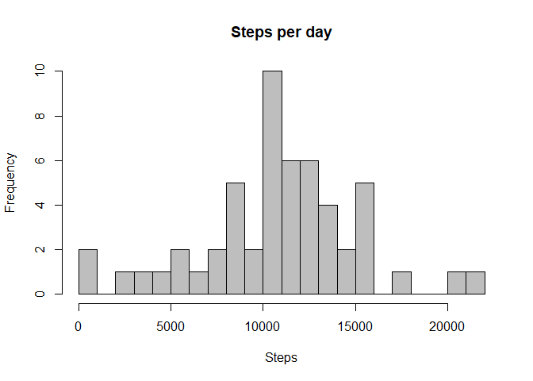
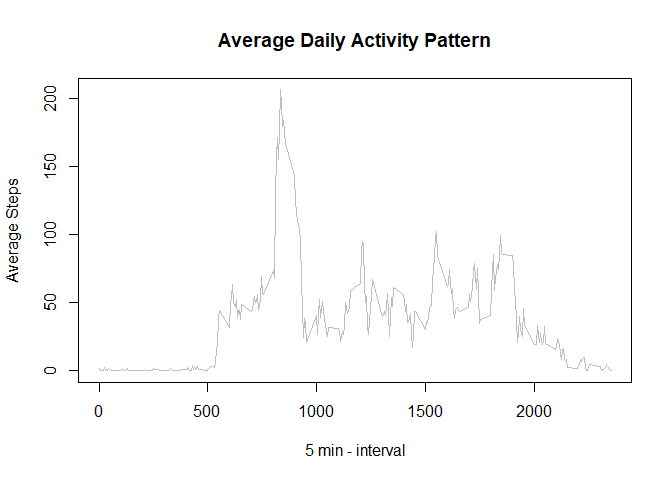
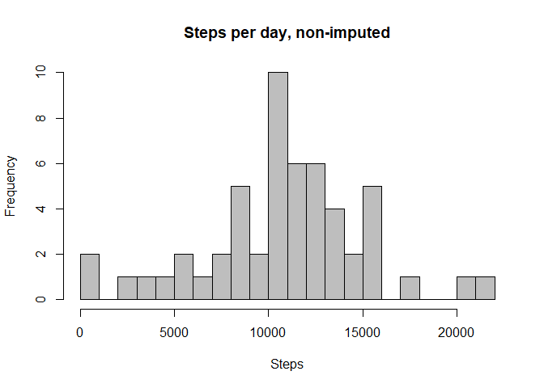
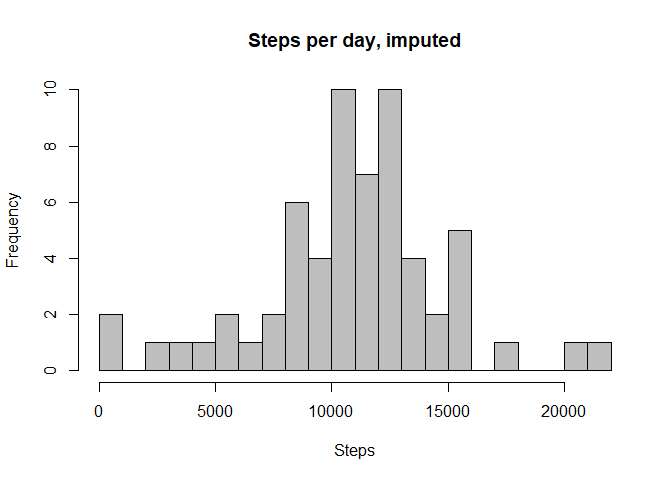
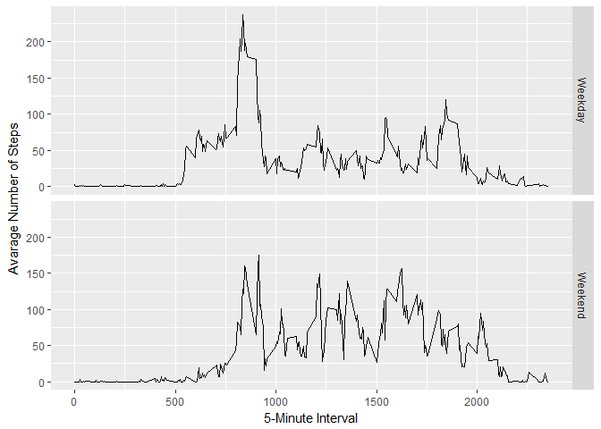

# Reproducible Research: Peer Assessment 1

# Required Packages
Package  | Description       
------------- | -------------
dplyr  | [dplyr package](https://cran.r-project.org/web/packages/dplyr/dplyr.pdf) 
pander  | [pander package](https://cran.r-project.org/web/packages/pander/pander.pdf) 
ggplot2 | [ggplot2](https://cran.r-project.org/web/packages/ggplot2/ggplot2.pdf) 


```r
## Load plyr package for manipulating data
## knitr::opts_chunk$set(error = TRUE)
library(dplyr)
library(pander)
library(ggplot2)

panderOptions("digits", 2)
```

#Introduction
It is now possible to collect a large amount of data about personal movement
using activity monitoring devices such as a Fitbit, Nike Fuelband, or Jawbone
Up. These type of devices are part of the "quantified self" movement - a group
of enthusiasts who take measurements about themselves regularly to improve
their health, to find patterns in their behavior, or because they are tech geeks.
But these data remain under-utilized both because the raw data are hard to
obtain and there is a lack of statistical methods and software for processing and
interpreting the data.

This analysis makes use of data from a personal activity monitoring device.
This device collects data at 5 minute intervals through out the day. The data
consists of two months of data from an anonymous individual collected during
the months of October and November, 2012 and include the number of steps
taken in 5 minute intervals each day.

#Loading and preprocessing the data

**Getting the Data**
The data can be downloaded from the following location [Activity monitoring data](https://d396qusza40orc.cloudfront.net/repdata%2Fdata%2Factivity.zip)

The variables included in this dataset are:

* steps: Number of steps taking in a 5-minute interval (missing values are
coded as NA)
* date: The date on which the measurement was taken in YYYY-MM-DD
format
* interval: Identifier for the 5-minute interval in which measurement was
taken

The dataset is stored in a comma-separated-value (CSV) file and there are a
total of 17,568 observations in this dataset.

Dataset  | Description
------------- | -------------
amd  | Activity data, septs, date, interval


```r
# Uncompress and load the data
# Variable amd (Activity Monitoring Data)
amd <- read.csv(unzip("activity.zip", "activity.csv"))

# Turn the date data into a valid date class
amd$date <- as.POSIXct(strptime(amd$date, "%Y-%m-%d"))
```


# What is mean total number of steps taken per day?

This section creates 4 datasets from the source file and presents them in both a hiostogram and tabular form.

Dataset  | Description
------------- | -------------
sum.spd  | Sum of steps per day

Create the datasets using the dplyr package to subset and aggrigate the data Use complete.cases to remove the NA values for these questions.

* Calculate the total number of steps taken per day.
* Make a histogram of the total number of steps taken each day.
* Calculate and report the mean and median of the total number of steps taken per day.


```r
sum.spd <- amd[complete.cases(amd), ]%>%
           group_by(date)%>% 
           summarise(steps=sum(steps))

## Plot the Sum of the Steps per Day
hist(sum.spd$steps, main = "Steps per day", xlab = "Steps", col = "grey", breaks = 20)
```

<!-- -->

**Report of mean and median of the total number of steps taken per day**


```r
## Display the data 
rep.values <-cbind(mean(sum.spd$steps), median(sum.spd$steps))
colnames(rep.values) <- c("Mean","Median")
pander(rep.values)
```


----------------
 Mean    Median 
------- --------
 10766   10765  
----------------

# What is the average daily activity pattern?

* Make a time series plot (i.e. type = "l") of the 5-minute interval (x-axis) and the average number of steps taken, averaged across all days (y-axis)

* Which 5-minute interval, on average across all the days in the dataset, contains the maximum number of steps?

Dataset  | Description
------------- | -------------
mean.spi  | Mean steps per interval


```r
mean.spi <- amd[complete.cases(amd), ]%>%
             group_by(interval)%>% 
             summarise(steps=mean(steps))


plot(mean.spi$interval, mean.spi$steps, type="l", xlab = "5 min - interval", ylab = "Average Steps", 
         main = "Average Daily Activity Pattern", col = "grey")
```

<!-- -->

**What interval has the biggest numbers of steps?**


```r
  pander(mean.spi$interval[which.max(mean.spi$steps)])
```

_835_

# Imputing missing values

Note that there are a number of days/intervals where there are missing values (coded as NA). The presence of missing days may introduce bias into some calculations or summaries of the data.

* Calculate and report the total number of missing values in the dataset (i.e. the total number of rows with NAs)
* Devise a strategy for filling in all of the missing values in the dataset. The strategy does not need to be sophisticated. For example, you could use the mean/median for that day, or the mean for that 5-minute interval, etc.
* Create a new dataset that is equal to the original dataset but with the missing data filled in.
* Make a histogram of the total number of steps taken each day and Calculate and report the mean and median total number of steps taken per day. Do these values differ from the estimates from the first part of the assignment? 
* What is the impact of imputing missing data on the estimates of the total daily number of steps?

**Count the number of missing values?**


```r
  pander(nrow(amd[is.na(amd$steps),]))
```

_2304_

**Are the missing values evenly distributed over the time intervals for given days?**


```r
  pander(amd[!complete.cases(amd), ] %>% group_by(weekdays(date))%>% summarise(steps=n()))
```


------------------------
 weekdays(date)   steps 
---------------- -------
     Friday        576  

     Monday        576  

    Saturday       288  

     Sunday        288  

    Thursday       288  

   Wednesday       288  
------------------------

**Imputed data strategy**

Fridays & Mondays have more missing values per interval than other days, Tuesdays have no missing interval values.

Impution stratagy is to compute the mean of the interval for the *day of the week* and *interval* and replace NA values with the mean of the matching predicates.

**Imputed Dataset**

Create a new dataset that is equal to the original dataset but with the missing data filled in.

Dataset  | Description
------------- | -------------
mean.interval.days  | Mean steps per interval per day of the week (Monday-Sunday)
amd.complete  | All complete cases
amd.nas | All incomplete cases
nas.imputed | Populated NA values with mean for matching intervals and days
amd.imputed | rbind of nas.imputed + amd.complete same nrows as amd dataset
sum.imputed | New version of sum.spd but with imputed values


```r
  # Calculate the mean steps per interval per day of the week (Monday-Sunday)
  mean.interval.days <- amd[complete.cases(amd), ]%>%
             group_by(interval, weekdays(date))%>% 
             summarise(steps=mean(steps))
 
  colnames(mean.interval.days) <- c("interval","days","steps") 

  ## Create complete and incomplete datasets
  amd.complete <- amd[complete.cases(amd), ]
  amd.nas <- amd[!complete.cases(amd), ]
  
  ## Create a day of the week column for the dataset
  amd.nas$days <- weekdays(amd.nas$date)
  
  ## Merge the datasets
  nas.imputed <- amd.nas %>% inner_join(mean.interval.days, by = c("interval","days"))  
  ## Keep only the required columns and drop the NA steps.x column
  nas.imputed <- nas.imputed[c("steps.y", "date", "interval")]
  ## Rename the columns
  colnames(nas.imputed) <- c("steps","date","interval") 
  
  ## Rebind the datasets
  amd.imputed <- rbind(amd.complete, nas.imputed)
  
  ## Create new aggrigate datasets
  sum.imputed <- amd.imputed%>%
             group_by(date)%>% 
             summarise(steps=sum(steps))

  hist(sum.spd$steps, main = "Steps per day, non-imputed", xlab = "Steps", col = "grey", breaks = 18) 
```

<!-- -->

```r
  hist(sum.imputed$steps, main = "Steps per day, imputed", xlab = "Steps", col = "grey", breaks = 18)
```

<!-- -->

```r
  rep.values <-cbind(mean(sum.spd$steps), median(sum.spd$steps), mean(sum.imputed$steps), median(sum.imputed$steps))
  colnames(rep.values) <- c("Est Mean","Est Median", "Mean Imputed", "Median Imputed")
  pander(rep.values)
```


-------------------------------------------------------
 Est Mean   Est Median   Mean Imputed   Median Imputed 
---------- ------------ -------------- ----------------
  10766       10765         10821           11015      
-------------------------------------------------------

The missing values reduce the overal frequency ~ 13000 steps per day, although the averages are marginally adjusted upwards.


#Are there differences in activity patterns between weekdays and weekends?

* Create a new factor variable in the dataset with two levels - "weekday" and "weekend" indicating whether a given date is a weekday or weekend day.
*  Make a panel plot containing a time series plot (i.e. type = "l") of the 5-minute interval (x-axis) and the average number of steps taken, averaged across all weekday days or weekend days (y-axis). 


Dataset  | Description
------------- | -------------
amd.imputed  | Same as amd.imputed but with extra column of type factor to indicated weekday or weekend 
imputed.spi  | Same as mean.spi but with imputed values and extra column of type factor to indicated weekday or weekend 


```r
  # Add the dotw (Day of the Week) column to show if the data is a weekday or weekend
  # wday date property(0=Sun, 6=Sat & 1-5 Mon-Fri)

  amd.imputed$dotw <- as.factor(ifelse(weekdays(amd.imputed$date) 
                                        %in% c("Sunday","Saturday"), 
                                        'Weekend', 'Weekday'))

  # Imputed steps per interval group by interval and dotw
  imputed.spi <- amd.imputed%>%
                    group_by(interval, dotw)%>% 
                    summarise(steps=mean(steps))

  # Create facet based plot for ggplot
  ggplot(imputed.spi, aes(interval, steps)) + 
    geom_line() + 
    facet_grid(dotw ~ .) +
    xlab("5-Minute Interval") + 
    ylab("Avarage Number of Steps")
```

<!-- -->

The datasets show that the activity starts later at a weekend and there is a more even distribution in the middle intervals.

# Appendix - Session Info Package Versions

```r
sessionInfo()
```

```
## R version 3.4.2 (2017-09-28)
## Platform: x86_64-w64-mingw32/x64 (64-bit)
## Running under: Windows 10 x64 (build 15063)
## 
## Matrix products: default
## 
## locale:
## [1] LC_COLLATE=English_United Kingdom.1252 
## [2] LC_CTYPE=English_United Kingdom.1252   
## [3] LC_MONETARY=English_United Kingdom.1252
## [4] LC_NUMERIC=C                           
## [5] LC_TIME=English_United Kingdom.1252    
## 
## attached base packages:
## [1] stats     graphics  grDevices utils     datasets  methods   base     
## 
## other attached packages:
## [1] bindrcpp_0.2  ggplot2_2.2.1 pander_0.6.1  dplyr_0.7.4  
## 
## loaded via a namespace (and not attached):
##  [1] Rcpp_0.12.13     knitr_1.17       bindr_0.1        magrittr_1.5    
##  [5] munsell_0.4.3    colorspace_1.3-2 R6_2.2.2         rlang_0.1.2     
##  [9] plyr_1.8.4       stringr_1.2.0    tools_3.4.2      grid_3.4.2      
## [13] gtable_0.2.0     htmltools_0.3.6  lazyeval_0.2.1   yaml_2.1.14     
## [17] assertthat_0.2.0 rprojroot_1.2    digest_0.6.12    tibble_1.3.4    
## [21] reshape2_1.4.2   glue_1.2.0       evaluate_0.10.1  rmarkdown_1.6   
## [25] labeling_0.3     stringi_1.1.5    compiler_3.4.2   scales_0.5.0    
## [29] backports_1.1.1  pkgconfig_2.0.1
```
